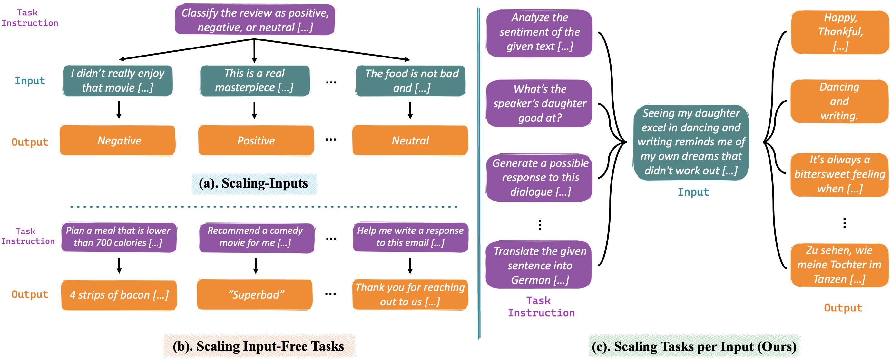
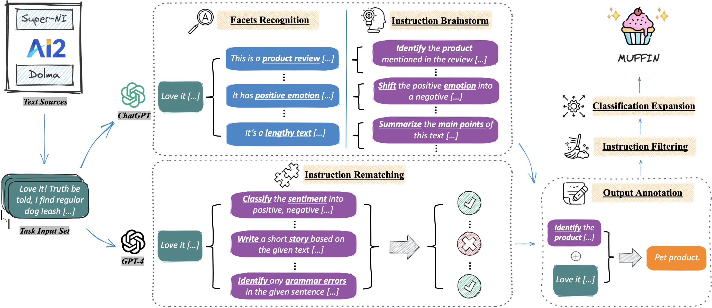

<h1 align="center">  MUFFIN </h1>

<p align="center">
<a href="https://renzelou.github.io/Muffin/"></a>
<a href="https://github.com/RenzeLou/Muffin/blob/github-page/static/paper/MUFFIN.pdf"></a>
  <a href="https://github.com/RenzeLou/Muffin/blob/master/LICENSE"></a>
  <!-- <a href="https://github.com/RenzeLou/Muffin"></a> -->
</p>

This repository contains the source code for reproducing the data curation of  **[MUFFIN]()** (Multi-faceted Instructions).

Our paper is available at: **[paper pdf](https://github.com/RenzeLou/Muffin/blob/github-page/static/paper/MUFFIN.pdf)**. 👈

Also don't forget to check our **[website](https://renzelou.github.io/Muffin/)** for more details. 👈

---

<p align="center" width="100%">
<a ></a>
</p>

As shown in the figure (c) above, we follow a novel <u>**Scaling Tasks per Input**</u> paradigm to collect **multiple** task instructions for a **single** input.


**Project Structure:**

```
-- data          # data folder, including the dummy data

-- pre_process   # pre-processing scripts, including the input text collection.

-- post_process  # post-processing scripts, including filtering, classification expansion, etc.

-- scripts  
|  -- instruction_brainstorm.sh   # shell script for instruction brainstorm
|  -- instruction_remataching.sh  # shell script for instruction rematching

-- chat_completion.py   # used for querying OpenAI API, shared by all the other scripts

-- prompt_templates.py  # contains all the prompt templates used in this work

-- generate_*.py        # all the scripts starting with "generate_" are used for data generation (e.g., facets and instruction generation)
```

## 📚 Data Release

`data/muffin_dummy.json` contains some dummy instances of MUFFIN. We release our full dataset on the HuggingFace 🤗.

- **[MUFFIN 68k](https://huggingface.co/datasets/Reza8848/MUFFIN_68k)**

## 🤖 Model Release

We fine-tune **T5-3B** and **T5-11B** on MUFFIN. Our fine-tuning code is based on [Tk-Instruct](https://github.com/yizhongw/Tk-Instruct/tree/main). The fine-tuned models are available on the HuggingFace 🤗.

- **[MUFFIN-T5-3B](https://huggingface.co/Reza8848/MUFFIN-T5-3B)**
- **[MUFFIN-T5-11B](https://huggingface.co/Reza8848/MUFFIN-T5-11B)**


## 🦾 Data Curation

<p align="center" width="100%">
<a ></a>
</p>

As shown in the above illustration, in this work, we mainly adopt two different instruction collection methods: 

- **Instruction Brainstorm**: Let LLMs generate instructions based on the input (and its facets).
- **Instruction Rematching**: Reusing existing human-crafted instructions on the input, evaluated by LLMs.


#### 0. Environment Setup

```bash
conda create -n muffin_data python=3.8.5
conda activate muffin_data
pip install -r requirements.txt
```

#### 1. Input Collection

First, we have to collect the input texts. In our paper, we use two distinct input sources to promote data diversity, namely the inputs from [Super-Natural Instructions](https://instructions.apps.allenai.org/) (the training set) and [Dolma](https://huggingface.co/datasets/allenai/dolma). 

Please follow their official documents downloading the above data. And then, process them into an apprpriate json format. For example, for an instance in SuperNI, the final json format should be like below (please refer to the `data/input_text_dummy.json` for more details):

```json
{
    "id": "SuperNI-task291-ab63f213cfd240ce80a71eee0a329a83",
    "instruction": "In this task, you are given two natural language statements with similar wording. You must choose the statement that makes less sense based on common sense knowledge. A '\n' separates the statements. Use \"first\" or \"second\" to indicate which sentence makes less sense.",
    "input": "Drink more wine when you feel thirsty.\nDrink more water when you feel thirsty",
    "output": [
      "first"
    ]
}
```

The most important field of this json object is the `input`. As for the other fields, you can simply fill them with dummy values (such as `None`).

> **Note**
>
> Due to the complex file structure of SuperNI and the extreme large size of Dolma, we don't provide the detailed preprocessing scripts. 
> 
> However, feel free to use any other text sources (e.g., multi-task datasets or pretraining corpus). We anticipate that any free-form text corpus can be used in our pipeline. Only to make sure that the input texts are in the json format as above. 😊😊😊


#### 2. Instruction Brainstorm

We adopt two-step instruction generation: 1) ask LLMs (ChatGPT) to recognize various facets (aka attribute) of the given input; 2) using the recognized facets as **hints**, ask LLMs (ChatGPT) to generate instructions. 

Run the following command to generate brainstormed instructions:

```bash
sh scripts/instruction_brainstorm.sh [args_1] [args_2]  # args_1: json file containing input texts (e.g., input_text_dummy.json); args_2: your API key for OpenAI API
```

The generated brainstormed instructions will be saved at `data/brainstorm_1.json`.

Feel free to modify the shell script to try with other API models. 

#### 3. Instruction Rematching

We collect existing high-quality human instructions (from SuperNI) and let LLMs (GPT-4 in this case) to evaluate each instruction on the given input (*can the given input and instruction form a valid task?*).

Please first prepare the (instruction, input) candiate pairs, which should be in the following json format (please refer to the `data/rematch_candidate_dummy.json` for more details):

```json
{
  "id": "SuperNI-task291-ab63f213cfd240ce80a71eee0a329a83-0",
  "instruction": "Given a scientific question and its correct answer, generate supporting facts for the answer. This supporting fact can be an explanation for the answer to the given question.",
  "input": "Drink more wine when you feel thirsty.\nDrink more water when you feel thirsty",
  "output": [],
  "judge": "Unknown"
}
```

Where the `judge` field is the judgement label to decide whether the given instruction is valid for the given input, **it's value should be set as "Unknown"** (that will be further evaluated by LLMs as "yes" or "no").


> **Note**
> Similarly, besides SuperNI, feel free to use candidate pairs with any other human instructions and input texts. 


Then, run the following command to collect the rematched instructions:

```bash
sh scripts/instruction_remataching.sh [args_1] [args_2]  # args_1: json file containing candidate pairs (e.g., rematch_candidate_dummy.json); args_2: your API key for OpenAI API
```

The generated rematched instructions will be saved at `data/rematched.json`.


#### 4. Data Merging

Finally, we merge the brainstormed instructions and rematched instructions into a single json file. 

```bash
python post_process/mix_rematched_brainstorm_same_x.py --brainstorm_data ./data/brainstorm_1.json --remathced_data ./data/rematched.json --mix_save_path ./data --mix_save_file muffin_final_data.json
```

The final data will be saved at `data/muffin_final_data.json`.


## 🥳 Citation

Please kindly cite our paper if you use any resources in this repository:

<!-- TODO: has to be updated -->
```
@misc{Lou2023MUFFIN,
      title={MUFFIN: Curating Multi-Faceted Instructions for Improving Instruction-Following}, 
      author={Renze Lou and Kai Zhang and Jian Xie and Yuxuan Sun and Janice Ahn and Hanzi Xu and Yu su and Wenpeng Yin},
      year={2023},
      primaryClass={cs.CL}
}
```


---

<!-- omit in toc -->
## ⭐ Star History

[](https://star-history.com/#RenzeLou/Muffin&Date)
